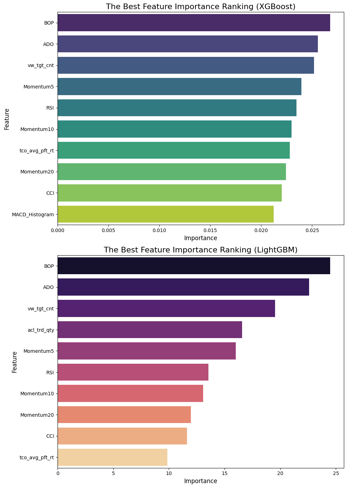
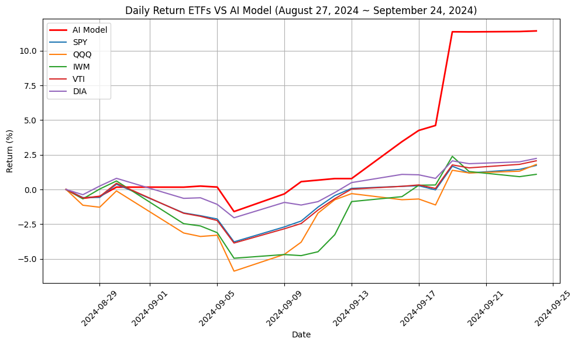

# U.S.-ETF-Curation
NH Investment Big Data Competition - U.S. ETF curation model focused on profitability and interpretability.

## Overview

"U.S. ETF Curation" is a project aimed at building an ETF curation model that outperforms market indices and the portfolio returns of other asset management firms. This project leverages an AI model based on interpretability to simplify ETF investment decisions and provides a portfolio algorithm that responds promptly to market fluctuations.

### Objectives
- Achieve excess returns over market indices
- Design an interpretable ETF curation model
- Develop an algorithm that quickly adapts to market changes
- Address the complexity of ETF selection

---

## Features

- **Data Exploration**: Analysis of price movement tracking between ETFs and their constituent stocks
- **Feature Preparation**: Collection of 59 features influencing stock prices (e.g., opening/high/low/closing prices, technical indicators)
- **Feature Engineering**: Optimal feature selection using GA-ML (Genetic Algorithm + Tree Models) and Importance Score Filtering (ISF)
- **Model Training**: Comparison of XGBoost, LightGBM, RandomForest, and SVM models to select the best performer (based on F1-Score)
- **Trading Simulation**: Validation of actual returns over the period from August 27, 2024, to September 24, 2024

---

## Methodology

1. **Data Preprocessing**
   - Adjust data scale using Max-Min normalization:  
     $$X' = \frac{X - X_{\text{min}}}{X_{\text{max}} - X_{\text{min}}}$$
     
     Normalizes data to a range between 0 and 1 based on minimum and maximum values.

   - Calculate excess stock returns (Target):  
     $$ExcessReturn_{t+1} = StockReturn_{t+1} - BenchmarkReturn_{t+1}$$
     
     Measures the stock's performance relative to a benchmark at time $$\(t+1\)$$.

2. **Feature Selection**
   - Combine Genetic Algorithm (GA) with tree models (XGBoost, LightGBM) for feature selection
   - Utilize tree-structured models to enhance interpretability
   - Filter top 20% feature set using Importance Score Filtering (ISF)

   

3. **Model Training**
   - Compare performance across memory periods (5, 10, 15, 20 days) using Markovian Property:  
     $$P(X_t | X_{t-1}, X_{t-2}, \ldots, X_0) = P(X_t | X_{t-1})$$  
     Indicates that the current state $$\(X_t\)$$ depends only on the previous state $$\(X_{t-1}\)$$, not the full historical sequence.

   - Optimal models: RandomForest for short-term (5 days), SVM for long-term (20 days)

4. **ETF Recommendation Algorithm**
   - Predict excess returns per stock and calculate ETF weights
   - Recommend buying if weight exceeds 50%, selling if below 45%

5. **Portfolio Algorithm**
   - Dynamically adjust investment allocation based on market sentiment (bullish/bearish)
   - Fine-tune weights according to excess return probabilities

---

## Results

- **Optimal Model Performance** (August 27, 2024 ~ September 24, 2024)
  - GA-XGBoost + RandomForest: **11.4% return**
  - GA-LightGBM + RandomForest: **7.07% return**
- **Comparison**
  - Outperforms major U.S. ETFs (SPY, QQQ, IWM, VTI, DIA)
  - Superior to Fint (4%) and Bullio (5.01%) in returns

   
---

## Project Structure
```
U.S.-ETF-Curation/
├── results/            # Graphs and simulation results
├── src/                # Code file
├── U.S._ETF_Curation.ipynb  # Main notebook file
├── README.md           # Project description
└── requirements.txt    
```

---

## References

- "Interpretable stock price forecasting model using genetic algorithm-machine learning regressions and best feature subset selection" by Kyung Keun Yun et al., 2023.

- "Integrated Long-Term Stock Selection Models Based on Feature Selection and Machine Learning Algorithms for China Stock Market" by XIANGHUI YUAN et al, 2020.

---

## Contact

- Author: [arkjackson](https://github.com/arkjackson)
- Email: mihy1968@gmail.com
